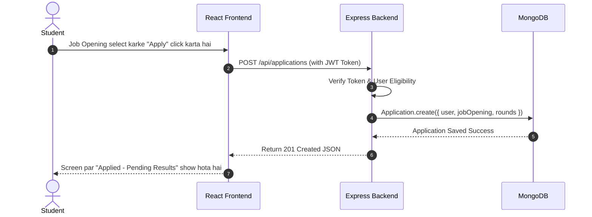
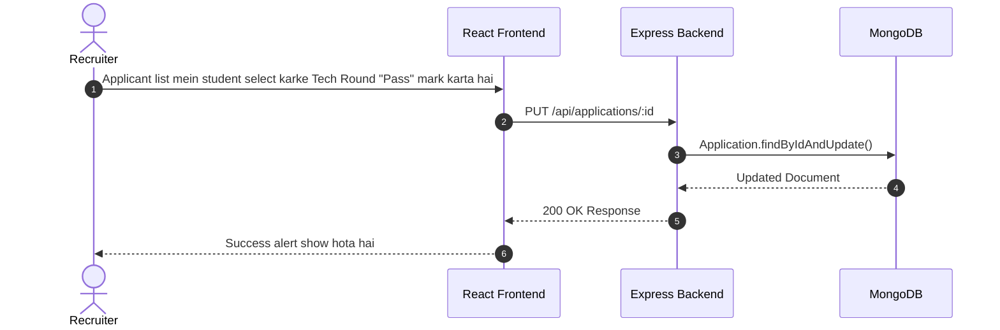

# 🎓 LIET Training & Placement Portal - Complete Project Explained (Hinglish Guide)

> **Ek Beginner College Student ke liye Simple, Friendly aur Comprehensive Guide**  
> Yeh guide padhne ke baad aap kisi bhi teacher ya interviewer ko yeh project 100% confidence ke saath explain kar payenge!

---

## 📌 Table of Contents
1. [Yeh Project Kya Hai? (What is this project?)](#1-yeh-project-kya-hai)
2. [Yeh Project Kaunsi Problem Solve Karta Hai? (Problem Statement)](#2-problem-statement)
3. [Simple Everyday Analogy (Asaan Bhasha Mein Samjhein)](#3-simple-everyday-analogy)
4. [Project Ka Architecture (3-Tier Architecture)](#4-project-ka-architecture)
5. [User Roles aur Unke Features (Main Features by Roles)](#5-user-roles-aur-features)
6. [Complete Flow (User Input se Final Result Tak)](#6-complete-flow)
7. [Tech Stack (Kaunsi Technology Kyun Use Hui Hai?)](#7-tech-stack)
8. [Data Flow Diagrams (Mermaid Visuals)](#8-data-flow-diagrams)

---

## 1. Yeh Project Kya Hai?
**LIET Placement Portal** ek full-stack web application (MERN Stack) hai jo college ke Training and Placement (T&P) cell ke poore process ko digitalize aur automate karta hai.

Is portal ke through:
- **Students** nayi company job openings dekh sakte hain, 1-click mein apply kar sakte hain, aur apne test/interview ka round-by-round status track kar sakte hain.
- **Recruiters (Company HRs)** apne company ki job requirements (CTC, eligible branches, rounds) post kar sakte hain aur applicants ke results update kar sakte hain.
- **T&P Cell Admin** poore system ko monitor karta hai, students aur recruiters ko verify/approve karta hai aur placements smooth chalata hai.

---

## 2. Problem Statement
Pehle college placement process manual hota tha:
- Google Forms aur Excel sheets se data collect hota tha, jisme duplicate entries aur mismatch ka risk rehta tha.
- Students ko pata nahi chalta tha ki unka shortlist status kya hai.
- Recruiters ko eligibility filter karne mein bohot time lagta tha.

**Solution:** Ek centralized real-time web portal jo secure authentication (OTP-based), automated eligibility filtering aur live status updates provide karta hai.

---

## 3. Simple Everyday Analogy
Is MERN system ko samajhne ke liye ek **Restaurant** ka example lete hain:

| Real-Life Concept | Web Development Term | Project Mein Iska Role |
|---|---|---|
| **Dukaan ka Counter / Menu Card** | **Frontend (React.js)** | UI jahan student/recruiter buttons click karte hain aur data enter karte hain. |
| **Waiter (Order lane aur le jane wala)** | **API (Express Routes & Axios)** | Frontend se request lekar Backend tak le jata hai aur response wapas lata hai. |
| **Kitchen ke Master Chefs** | **Backend (Node.js & Express)** | Logic run karte hain (OTP generate karna, token verify karna, eligibility calculate karna). |
| **Store Room / Fridge** | **Database (MongoDB)** | Jahan students ke resumes, login info aur company job details hamesha ke liye store rehte hain. |

---

## 4. Project Ka Architecture
Yeh project **MERN 3-Tier Architecture** follow karta hai:

```
+-------------------------------------------------------------+
|               CLIENT TIER (Frontend - React.js)             |
|   Screens (Login, Dashboard, Applications) + Redux State    |
+-------------------------------------------------------------+
                              |
                     HTTP / JSON (REST API)
                              |
+-------------------------------------------------------------+
|              SERVER TIER (Backend - Express / Node.js)       |
|    Routes -> Auth Middleware (JWT) -> Controllers -> Logic  |
+-------------------------------------------------------------+
                              |
                    Mongoose ORM Queries
                              |
+-------------------------------------------------------------+
|               DATABASE TIER (MongoDB Server)                |
|      Collections: Users, Recruiters, JobOpenings, Apps      |
+-------------------------------------------------------------+
```

---

## 5. User Roles aur Features

### 👨‍🎓 Role 1: Student (User)
- **Passwordless OTP Login:** Email enter karo aur registered OTP ke through login karo.
- **Live Job Feed:** Apne criteria (B.Tech / M.Tech / FTE / Internship) ke anusaar approved companies dekhna.
- **1-Click Apply:** Company requirements match hone par job ke liye apply karna.
- **My Applications Tracker:** Round-wise tracker:
  - Aptitude Test ⏳
  - Online Technical Test ⏳
  - Group Discussion ⏳
  - Technical Interview ⏳
  - HR Interview ⏳
- **PDF Resume Viewer:** Profile aur application mein uploaded resume preview karna.

### 🏢 Role 2: Recruiter (Company HR)
- **Profile Registration:** Company details, designation aur office address register karna.
- **Job Creation:** Job opening create karna with detailed CTC breakdown (Base Pay, Stocks, Relocation), eligibility criteria (CGPA cutoff, 10th/12th cutoffs, allowed branches).
- **Candidate Assessment:** Har student ke application round ko update karna (`Pass`, `Fail`, `Pending`, `Delay Results`).

### 🛡️ Role 3: Placement Admin (T&P Officer)
- **Recruiter Approval:** Fake ya unverified companies ko block karna aur authentic companies ko approve karna.
- **Student Management:** Students ki list dekhna aur unka profile verify karna.
- **System Monitoring:** Sabhi live job openings aur applications ka status monitor karna.

---

## 6. Complete Flow (User Action se Database Tak)

```
[User Form Submit Karta Hai]
            ↓
[React Component state update karta hai]
            ↓
[Redux Action Axios ke through Backend API call karta hai (e.g. POST /api/users/login)]
            ↓
[Express Route request ko receive karta hai]
            ↓
[Auth Middleware check karta hai ki user authorized hai ya nahi (JWT token verify)]
            ↓
[Controller function execute hota hai aur Mongoose model ko call karta hai]
            ↓
[MongoDB Query execute hoti hai aur data save/fetch hota hai]
            ↓
[Backend response JSON format mein return karta hai]
            ↓
[Redux Reducer state update karta hai aur React UI instantly re-render ho jata hai]
```

---

## 7. Tech Stack

| Technology | Layer | Kyun Use Ki Gayi? |
|---|---|---|
| **React.js (v18)** | Frontend | Single Page Application (SPA) fast UI render karne ke liye. |
| **Redux & Thunk** | State Management | Global user state, job list, aur login tokens ko easily manage karne ke liye. |
| **React-Bootstrap** | Styling | Clean, responsive grid system aur ready-to-use modern components. |
| **Node.js** | Runtime Environment | High-performance asynchronous backend runtime. |
| **Express.js** | Backend Web Framework | REST API endpoints, routing aur middleware handle karne ke liye. |
| **MongoDB & Mongoose** | Database & ODM | Flexible JSON-like document storage jo structured data easily save karta hai. |
| **JSON Web Token (JWT)** | Security / Auth | Stateless secure user session maintain karne ke liye. |
| **PDF.js Viewer** | Utility | In-browser PDF resume preview bina download kiye. |

---

## 8. Data Flow Diagrams

### Student Job Application Flow


### Recruiter Evaluation Flow

